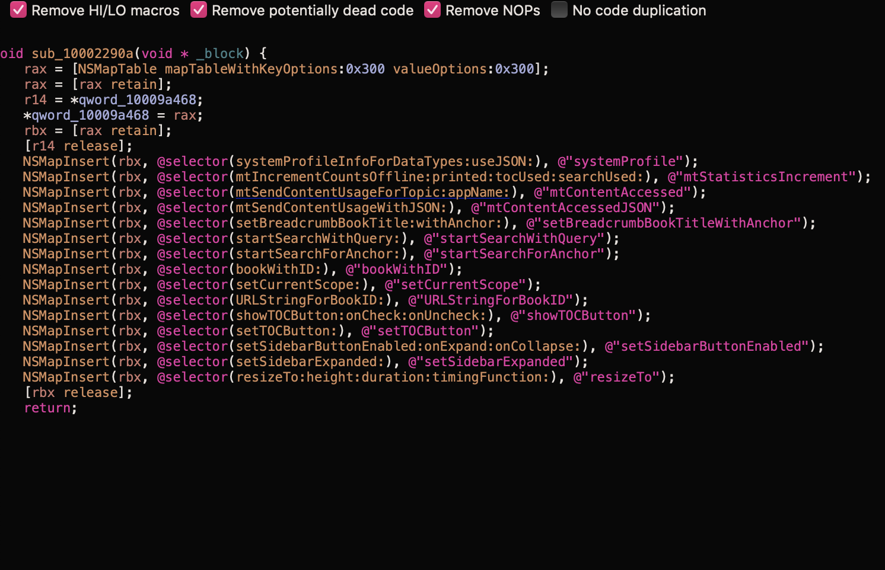
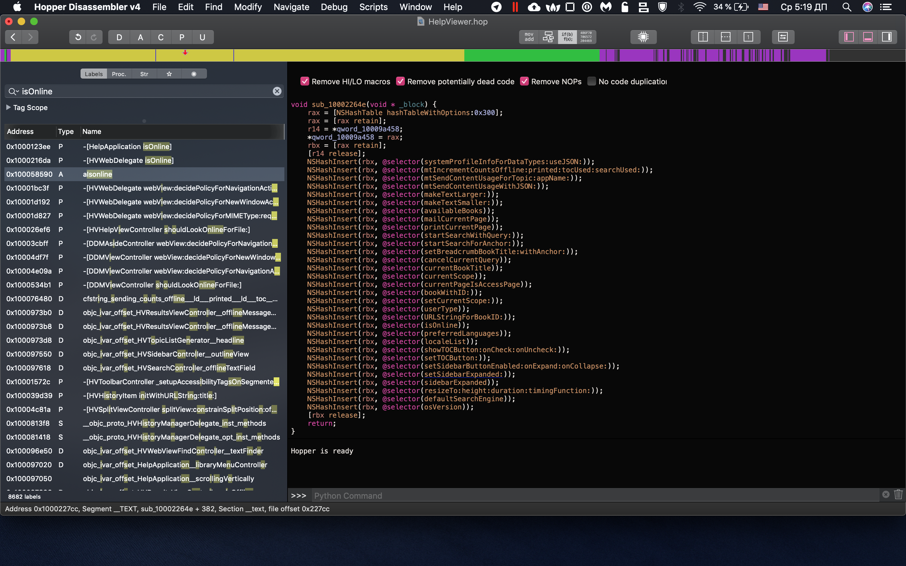
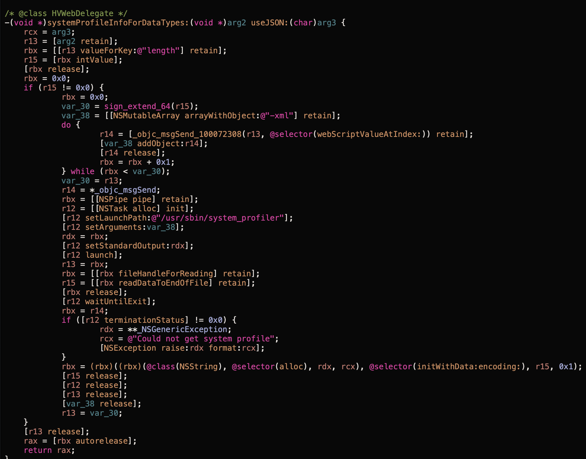

# Parallels for Mac: `system_profiler` output leak and launching of arbitrary apps via help: URI

> What is [Helpviewer.app](https://en.wikipedia.org/wiki/Apple_Help_Viewer)?


## Intro

What's your favorite security bug?
One of my favorite bugs is [GPZ-1040](https://bugs.chromium.org/p/project-zero/issues/detail?id=1040).

## Summary

A remote attacker in a privileged network position can launch arbitrary apps and disclose output of `system_profile` util via `help:` URI that opens `ParallelsDesktopHelp.help`. (`help:openbook=com.parallels.desktop.console.help`)

## Description

Parallels for Mac has a helpbook located at `/Applications/Parallels Desktop.app/Contents/Resources/ParallelsDesktopHelp.help`.
The helpbook URL points to a non-secured HTTP resource

```xml
	<key>HPDBookRemoteURL</key>
	<string>http://download.parallels.com/desktop/v14/docs/</string>
```

As soon as `ParallelsDesktopHelp.help` will be opened via `help:` URI, this URL will be displayed in the HelpViewer's window.

An attacker with MITM access can respond to the HTTP request with own payload.

> Apple has been hardening `HelpViewer.app` for a while. However, during the research, I found certain bypasses/HelpViewer features.

### Attack vector - Network

Attacker can open Parallels helpbook in `HelpViewer.app` by navigating to `help:` URI from the browser when the victim visits a webpage. **Safari** and `Mail.app` allow navigation to `Helpviewer.app` without confirmation from the user.

### State of security in HelpViewer.app

There've been many security issues (~6-7) in HelpViewer since 2003.
HelpViewer was finally hardened after [GPZ-1040](https://bugs.chromium.org/p/project-zero/issues/detail?id=1040).
Also, Apple removed most helpbooks from default macOS installation.

This research covers macOS 10.14.
Need to say, that macOS <10.13 allows HelpViewer to read local files and launch arbitrary files as was shown in the GPZ report.

### x-help-script://

`HelpViewer.app` has `x-help-script://` internal URI scheme that allows running applications and open SystemPreferences panels.
Example: `x-help-script://com.apple.machelp/scpt/OpnAppBndID.scpt?open,com.apple.calculator`.

> In macOS `<10.14` this scheme allows opening files. From my research, this feature was fixed in macOS `10.14`, because `OpnFile.scpt` now is noop in `10.14`.

#### Bypass `x-help-script:` hardening

After the latest patches, HelpViewer disallows triggering `x-help-script:` URI from HTTP resources.
However, the fix is insufficient. Attacker could init server-side redirect from `http://download.parallels.com` to `https://attackerhost` and bypass restrictions, which allows running arbitrary apps on the device.

**Impact**: Attacker can run arbitrary apps after redirect to HTTPS resource

### window.Helpviewer.systemProfile(Array)

HelpViewer's window has `[ObjCRuntime Object]` that is accessible to JS.
This binding is quite unusual. During the audit, I've found more info about this object in sources.




The most interesting thing for us is `HelpViewer.systemProfile`.
After playing a while with it I found that this method accepts supplied arguments and set them in `NSTask` object which starts `/usr/sbin/system_profiler` util.



The following command allows attacker to read output of `/usr/sbin/system_profiler -xml -nospawn SPFirewallDataType`:

```js
HelpViewer.systemProfile(["SPFirewallDataType"]);
```

**Impact**: attacker is able to read all system configuration.

### RCE?

As I said, `window.HelpViewer` bindings are poorly written (from security) and it should be possible to find memory corruptions.

> Infinite loop: `HelpViewer.systemProfile({length: -11111})`

## Version

Parallels for Mac: 14.1.0 (45387)
macOS: macOS 10.14.3

## PoC for HelpViewer

1. Copy HTML from `payload` variable from `attacker-https/index.js` to any helpbook on your system.
2. Open this helpbook and navigate to this page.

## PoC for Parallels for Mac

> Make `attacker-https/rootCA.pem` and `attacker-https/rootCA-kry.pem` trusted to reproduce on https://127.0.0.1

1. Setup MITM for http://download.parallels.com
2. Victim visits a page (`entrypoint`) that opens `Helpviewer.app`(`help:openbook=com.parallels.desktop.console.help`)
3. `Helpviewer.app` gets opened pointing to http://download.parallels.com (`download.paralles.com` folder)
4. Redirect to any `https://` site (`attacker-https`) to bypass Helpviewer restrictions.
5. `attacker-https` opens Calculator `x-help-script://com.apple.machelp/scpt/OpnAppBndID.scpt?open,com.apple.calculator`
6. Calculator popups
7. Output of `HelpViewer.systemProfile(['SPFirewallDataType'])` gets sent to `attacker-https` server

## PoC Usage

```sh
# make sure you trust certificates in `attacker-https` folder (or you can setup a remote https:// resource)
npm i # install express
# run entrypoint
node ./entrypoint.js
# in a separate window to run download.parallels.com
sudo node download.parallels.com.js
# in a separate window to run attacker-https
node attacker-https.js
# open http://localhost:5000
```

## Impact

Attacker in a privileged network position can run arbitrary apps, read device config via `system_profiler`.

> And likely init memory corruption via unspecified vectors.

## Fix

Just change `http` -> `https` :)
